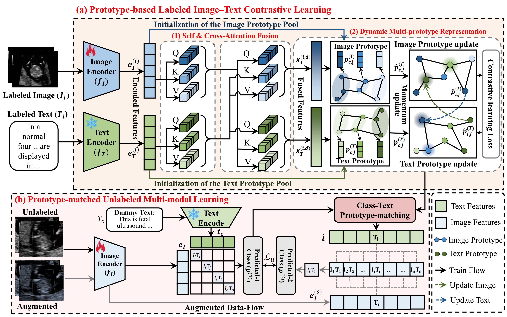

# PCLIM: Prototype-Based Category-Level Image--Text Multimodal Learning for Fetal Cardiac Ultrasound Analysis

<p align="center">
  <a href="https://github.com/SIGMACX/PCLIM"></a>
  
  
  
  
  
</p>

------------------------------------------------------------------------

## 🚀 Overview

PCLIM is a **category-level prototype-based multimodal learning
framework** for fetal cardiac ultrasound classification.

It replaces instance-level image--text alignment with **learnable
class-wise multi-prototype representations**, enabling robust learning
under **extremely limited annotations (1%--10%)**.

<p align="center">
  
</p>

------------------------------------------------------------------------

## 🔑 Key Ideas

-   🧠 Category-level alignment instead of instance matching
-   🔁 Dynamic multi-prototype memory (image & text dual pools)
-   ⚡ EMA-updated prototypes with online adaptation
-   🔍 Bidirectional cross-attention feature fusion
-   📉 Unlabeled data learning via teacher--student consistency

------------------------------------------------------------------------


## 📁 Dataset Format
```bash
data/EP_FCHD/
  training/
  testing/
  unlabel/

Classes:
0: 3VT_abnormal
1: 3VT_Norm
...
```
------------------------------------------------------------------------

## 🚀 Training
```bash
python -m cmpcn_ep_fchd.train \
  --data-root /path/to/EP_FCHD \
  --use-unlabel-folder \
  --labeled-ratio 0.1
```
------------------------------------------------------------------------


## 📌 Citation
If you use this repository, please cite the UGAC paper when citation information becomes available.
```bash
@INPROCEEDINGS{11357174,
  author={Chen, Xi and Tong, Lyuyang and Du, Bo},
  booktitle={2025 IEEE International Conference on Bioinformatics and Biomedicine (BIBM)}, 
  title={PCLIM: Prototype-Based Category-Level Image-Text Multimodal Learning Method for Fetal Cardiac Ultrasound Imaging Analysis}, 
  year={2025},
  pages={847-852},
  doi={10.1109/BIBM66473.2025.11357174}}
```
